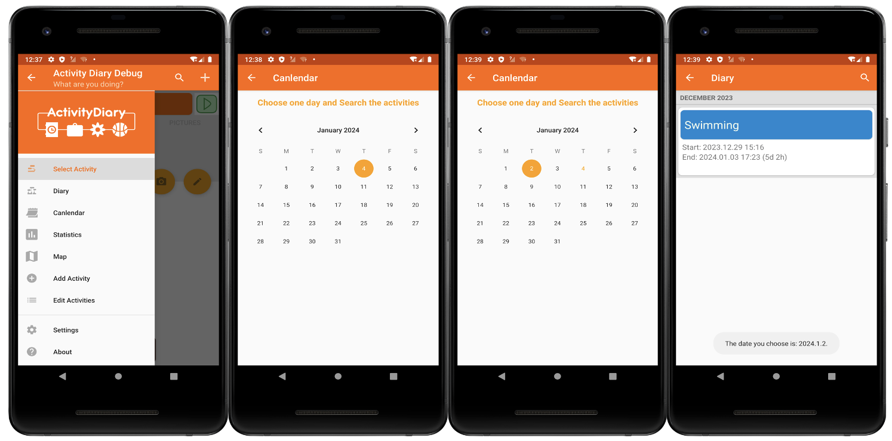
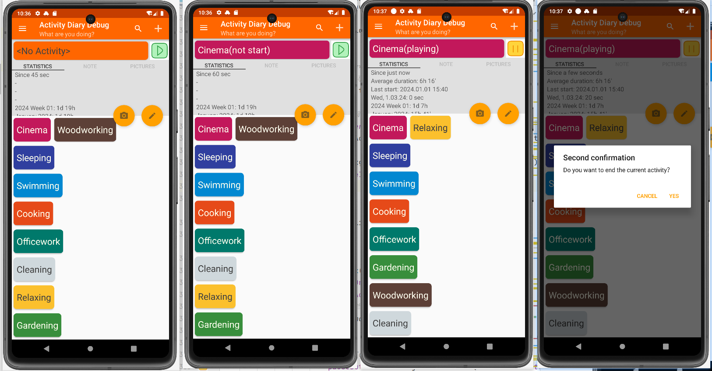

| 组员   | 学号        |
| ------ | ----------- |
| 杨勇军 | 10215101492 |
| 陈燿楠 |  10215101456           |

# Feature 1

### 功能描述：增加日历功能以快速查看当天活动

### UI:

### 用户需求：

在原始的app中，缺少对某一天所有活动的统筹，只能在“Diary”目录中以activity为单位查看，不能以“天”为单位查看活动。

增加了新功能之后

-   新增一个“日历”目录，可以打开日历视图并选择具体日期
-   可以快速查看该日期所做的所有活动
-   点击该活动，可以查看当前活动的具体情况
-   能便捷地返回主日历视图，并快速进行不同日期间的切换

### 功能用处：

以“天”为单位查看活动，并查看对应活动的具体情况。

# Feature 2

### 功能描述：增加切换活动时的二次确认及手动开始/结束活动的功能

### UI:

### 用户需求：

在原始的app中，用户点击活动卡片，会直接切换活动，很容易误触；且如果是想在结束一个活动之后，再次开始某个活动，又需要点击活动卡片。

增加了新功能之后

-   若当前活动标签栏有活动，用户通过点击开始按钮或长按进行按钮可以开始/结束活动。
-   若当前活动正在进行，则点击活动标签栏或点击活动卡片进行切换/结束任务，会弹出二次确认弹窗
-   若当前活动未开始，则点击活动标签栏或点击活动卡片进行切换活动，会切换活动标签栏显示的活动名。

### 功能用处：

防止误触，使活动开始/结束及切换活动的逻辑更加直观，方便理解。

### 系统架构，技术和工具：

AS, git, github

### 影响按时完成项目的风险：

-   对安卓开发相关技术的不熟悉，如service，设计模式，架构等

-   对工具使用的不熟悉，如使用git进行协同开发，AS的使用等
-   其他课程作业及考试带来的压力

